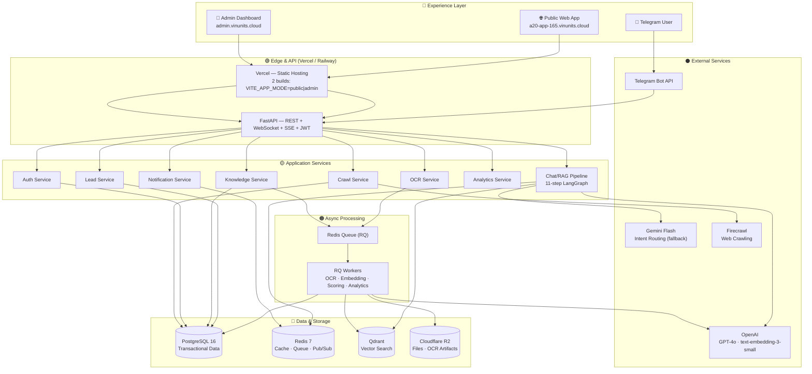
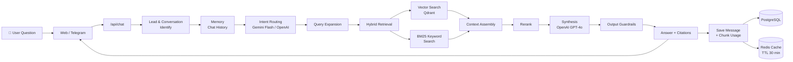
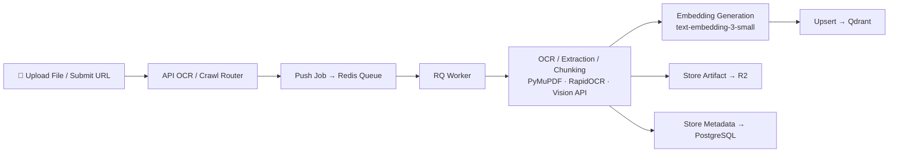
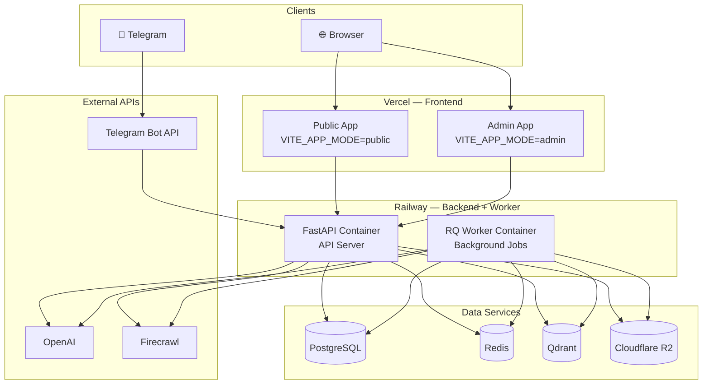

# A20 App — Hệ thống Tư vấn Tuyển sinh VinUni

> **AI-powered admissions counseling system** for VinUniversity. A multi-channel AI assistant that helps prospective students with admissions questions using RAG (Retrieval-Augmented Generation), while giving staff a full dashboard for lead management, knowledge base curation, and analytics.

**[🌐 Trang công khai](https://a20-app-165.vinunits.cloud)** &nbsp;|&nbsp; **[🔐 Admin Dashboard](https://admin.vinunits.cloud)** &nbsp;|&nbsp; **[📽️ Slide giới thiệu](https://slides.a20-app-165.vinunits.cloud)** &nbsp;|&nbsp; **[📖 API Docs](https://a20-app-165-production.up.railway.app/docs)** &nbsp;|&nbsp; **[🧭 Architecture](docs/ARCHITECTURE_DIAGRAMS.md)** &nbsp;|&nbsp; **[📝 AI Logs](docs/AI_LOGS.md)**

---

## Mục lục

1. [Mô tả ngắn gọn](#mô-tả-ngắn-gọn)
2. [Mục tiêu / Vấn đề giải quyết](#mục-tiêu--vấn-đề-giải-quyết)
3. [Tính năng chính](#tính-năng-chính)
4. [Kiến trúc hệ thống](#kiến-trúc-hệ-thống)
5. [Công nghệ sử dụng](#công-nghệ-sử-dụng)
6. [Hướng dẫn cài đặt](#hướng-dẫn-cài-đặt)
7. [Hướng dẫn chạy dự án](#hướng-dẫn-chạy-dự-án)
8. [Hướng dẫn sử dụng sản phẩm](#hướng-dẫn-sử-dụng-sản-phẩm)

---

## Mô tả ngắn gọn

A20 App là nền tảng tư vấn tuyển sinh thông minh dành cho **VinUniversity**. Hệ thống cung cấp một chatbot AI đa kênh (web, Telegram) có khả năng trả lời các câu hỏi về chương trình học, học bổng, học phí, yêu cầu đầu vào, và quy trình tuyển sinh. Phía backend, đội ngũ tư vấn viên (counselors) và quản trị viên (admins) có một dashboard đầy đủ để quản lý leads, theo dõi hội thoại, quản trị kho tri thức (knowledge base), xử lý tài liệu qua OCR, và phân tích dữ liệu.

---

## Mục tiêu / Vấn đề giải quyết

| Vấn đề | Giải pháp |
|--------|-----------|
| Sinh viên có quá nhiều câu hỏi lặp lại về tuyển sinh, học phí, học bổng | Chatbot AI RAG trả lời tự động 24/7 với thông tin chính xác từ kho tri thức |
| Tư vấn viên bị quá tải bởi hàng trăm câu hỏi giống nhau | AI xử lý câu hỏi phổ biến, tư vấn viên chỉ can thiệp khi cần (human handoff) |
| Thông tin tuyển sinh phân tán trên nhiều nguồn (website, PDF, Excel) | Pipeline OCR + Web Crawler tự động trích xuất và đưa vào kho tri thức |
| Khó theo dõi mức độ quan tâm của từng thí sinh | Hệ thống Lead Scoring tự động đánh giá mức độ quan tâm (HOT/WARM/COLD) |
| Thiếu dữ liệu để cải thiện chất lượng tư vấn | Phân tích FAQ, Daily Analytics giúp nhận diện xu hướng câu hỏi và lỗ hổng thông tin |

---

## Tính năng chính

### 🤖 Chatbot Tư vấn AI
- **RAG Pipeline** 11 bước (LangGraph): Input Guardrails → Memory → Intent Routing → Query Expansion → Hybrid Retrieval → Rerank → Synthesis → Output Guardrails
- **Hybrid Search**: Kết hợp tìm kiếm ngữ nghĩa (Qdrant vector) + từ khóa (BM25) cho độ chính xác cao
- **Intent Classification**: Tự động phân loại câu hỏi (học phí, học bổng, chương trình, yêu cầu đầu vào, quy trình, câu hỏi chung)
- **Multi-channel**: Web chat widget + Telegram bot
- **Answer Cache**: Redis cache 30 phút giúp giảm gọi LLM trùng lặp

### 📋 Quản lý Leads & Hội thoại
- Theo dõi toàn bộ hội thoại của từng lead
- Lead Scoring tự động (HOT / WARM / COLD) dựa trên hành vi
- Gán staff, phân loại trạng thái (NEW → CONTACTED → QUALIFIED → CONVERTED)
- Human Handoff: Chuyển hội thoại từ AI sang tư vấn viên khi cần

### 📚 Quản trị Kho Tri Thức (Knowledge Base)
- CRUD knowledge chunks với embeddings tự động
- Upload file (PDF, ảnh, Excel, CSV) và tự động OCR, chunk, embed
- Web Crawler (Firecrawl) để thu thập nội dung từ website
- Rebuild missing embeddings khi cần

### 📊 Dashboard & Phân tích
- Thống kê tổng quan: leads, hội thoại, câu hỏi phổ biến
- FAQ Analytics: Nhận diện câu hỏi thường gặp và lỗ hổng thông tin
- Daily Analytics: Theo dõi xu hướng theo ngày
- Lead Activity Log: Lịch sử tương tác của từng lead

### 🔔 Thông báo & Real-time
- SSE (Server-Sent Events) cho cập nhật trực tiếp
- WebSocket cho real-time chat
- Thông báo đa kênh (in-app, Telegram)

### 🔐 Bảo mật — Tách biệt Public / Admin
- **Trang công khai** (`a20-app-165.vinunits.cloud`): Chỉ chứa trang chủ và chat widget. **Không** hiển thị nút đăng nhập admin, không có route `/login` hay `/admin`.
- **Trang quản trị** (`admin.vinunits.cloud`): Subdomain riêng biệt, chỉ chứa trang login và admin dashboard. Người dùng ngoài không thể biết sự tồn tại của cổng admin từ trang công khai.
- Hai bản build Vite tách biệt, chọn router qua `VITE_APP_MODE` env var (`public` / `admin`).
- CORS backend chỉ cho phép origin từ các domain được phê duyệt.

---

## Kiến trúc hệ thống

> Sơ đồ chi tiết: [`docs/ARCHITECTURE_DIAGRAMS.md`](docs/ARCHITECTURE_DIAGRAMS.md) &nbsp;|&nbsp; ADR: [`docs/ARCHITECTURE_DECISIONS.md`](docs/ARCHITECTURE_DECISIONS.md) &nbsp;|&nbsp; Lát cắt: [`docs/ARCHITECTURE_SLICES.md`](docs/ARCHITECTURE_SLICES.md)

### Sơ đồ tổng quát



### Luồng Chat RAG (11 bước LangGraph)



### Luồng OCR & Crawl Ingest



### Triển khai (Deployment)



---

## Công nghệ sử dụng

| Tầng | Công nghệ | Mục đích |
|------|-----------|----------|
| **Frontend** | React 19, TypeScript, Vite 7, Tailwind CSS v4, shadcn/ui | Giao diện người dùng |
| **Frontend Split** | 2 bản build Vite riêng biệt (`VITE_APP_MODE=public\|admin`) | Tách biệt public/admin để bảo mật |
| **Backend** | FastAPI (Python 3.12), SQLAlchemy 2.0, Alembic | REST API, xử lý logic |
| **Database** | PostgreSQL 16 | Lưu trữ dữ liệu chính |
| **Cache / Queue** | Redis 7 + RQ (Redis Queue) | Cache, rate limit, job queue, pub/sub |
| **Vector Store** | Qdrant | Tìm kiếm ngữ nghĩa, hybrid retrieval |
| **Storage** | Cloudflare R2 (S3-compatible) | Lưu file, OCR artifacts |
| **AI / LLM** | OpenAI GPT-4o, text-embedding-3-small | Tổng hợp câu trả lời, embeddings |
| **AI Router** | Gemini Flash (optional, fallback to OpenAI) | Phân loại ý định nhanh |
| **LLM Orchestration** | LangGraph 0.4 | Điều phối pipeline chat 11 bước |
| **OCR** | PyMuPDF, pytesseract, OpenAI Vision | Trích xuất văn bản từ tài liệu |
| **Crawling** | Firecrawl | Thu thập nội dung web |
| **Auth** | JWT (python-jose), bcrypt | Xác thực & phân quyền |
| **Real-time** | WebSocket, SSE | Cập nhật trực tiếp |
| **i18n** | i18next, react-i18next | Đa ngôn ngữ (Vi / En) |
| **Deploy** | Docker Compose, Railway (backend), Vercel (frontend) | Triển khai containerized |

---

## Hướng dẫn cài đặt

### Yêu cầu hệ thống

- **Python** 3.11+
- **Node.js** 18+
- **Docker** & **Docker Compose** (khuyến nghị)
- Hoặc cài thủ công: PostgreSQL 16, Redis 7, Qdrant

### 1. Clone repository

```bash
git clone <repo-url>
cd A20-App-165
```

### 2. Cấu hình biến môi trường

```bash
cp .env.example .env
```

Mở `.env` và điền các thông tin bắt buộc:

| Biến | Mô tả |
|------|-------|
| `OPENAI_API_KEY` | API key OpenAI (bắt buộc) |
| `GEMINI_API_KEY` | API key Gemini (tùy chọn, dùng cho intent routing) |
| `POSTGRES_USER`, `POSTGRES_PASSWORD`, `POSTGRES_DB` | Thông tin kết nối database |
| `QDRANT_API_KEY` | API key cho Qdrant |
| `R2_ACCOUNT_ID`, `R2_ACCESS_KEY_ID`, `R2_SECRET_ACCESS_KEY`, `R2_BUCKET_NAME` | Thông tin Cloudflare R2 |
| `SECRET_KEY` | Secret key cho JWT |
| `FIRECRAWL_API_KEY` | API key Firecrawl (tùy chọn, dùng cho web crawler) |
| `TELEGRAM_BOT_TOKEN` | Token Telegram bot (tùy chọn) |

### 3. Khởi động bằng Docker (khuyến nghị)

```bash
# Khởi động tất cả services (PostgreSQL, Qdrant, Redis, API)
docker compose up -d

# Khởi động thêm RQ Worker (cho OCR và background jobs)
docker compose --profile queue up -d
```

### 4. Hoặc cài đặt thủ công

```bash
# Backend
pip install -r requirements.txt
alembic upgrade head

# Frontend
cd vite-app
npm install
```

---

## Hướng dẫn chạy dự án

### Chạy với Docker (đã chạy từ bước trên)

Các services sẽ tự động khởi động:
- **API**: http://localhost:8000
- **API Docs (Swagger)**: http://localhost:8000/docs
- **Qdrant Dashboard**: http://localhost:6333/dashboard
- **Admin Bootstrap**: Tài khoản admin mặc định được tạo tự động (xem `.env`)

### Chạy thủ công (development)

**Backend:**
```bash
# Terminal 1: API server
uvicorn src.main:app --reload --port 8000

# Terminal 2: RQ Worker (cho OCR và side effects)
python -m rq.cli worker --url redis://localhost:6379/0 default
```

**Frontend:**
```bash
# Terminal 3: Vite dev server
cd vite-app
npm run dev
# => http://localhost:5173
```

### Kiểm tra trạng thái

```bash
# Kiểm tra API
curl http://localhost:8000/api/health

# Xem API docs
open http://localhost:8000/docs
```

---

## Hướng dẫn sử dụng sản phẩm

### Tài khoản demo (dành cho Ban Giám Khảo)

| Vai trò | Email | Mật khẩu | Trang truy cập |
|---------|-------|----------|----------------|
| **Quản trị viên (Admin)** | `admin@test.com` | `admin123` | [admin.vinunits.cloud/login](https://admin.vinunits.cloud/login) |
| **Cố vấn (Counselor)** | `hhh@gmail.com` | `12345678` | [admin.vinunits.cloud/login](https://admin.vinunits.cloud/login) |

> **Quyền hạn:**
> - **Admin**: Toàn quyền — quản lý staff, leads, knowledge base, OCR, crawl, analytics, scholarship & tuition policies.
> - **Counselor**: Quản lý leads, hội thoại, xem dashboard & analytics. Không truy cập được Staff Management, Quick Processing, Web Crawler.

### Dành cho Sinh viên (Chat Widget)

1. Truy cập trang chat widget (được nhúng vào website VinUni hoặc truy cập trực tiếp)
2. Nhập thông tin cơ bản (tên, email, số điện thoại) để bắt đầu hội thoại
3. Đặt câu hỏi về chương trình học, học bổng, học phí, yêu cầu đầu vào...
4. Chatbot AI sẽ trả lời tự động. Nếu cần hỗ trợ thêm, có thể yêu cầu **"Liên hệ tư vấn viên"** để được staff hỗ trợ trực tiếp

### Dành cho Tư vấn viên (Staff Dashboard)

1. Truy cập **Admin Dashboard** tại **[admin.vinunits.cloud](https://admin.vinunits.cloud)**
   
   **Tài khoản demo:**
   - **Admin**: `admin@test.com` / `admin123`
   - **Cố vấn**: `hhh@gmail.com` / `12345678`

2. Đăng nhập với tài khoản được cấp (email + password)
3. **Trang Dashboard**: Xem tổng quan leads, hội thoại, thống kê
4. **Leads**: Quản lý danh sách thí sinh, xem chi tiết, cập nhật trạng thái, gán staff
5. **Messages**: Xem và trả lời hội thoại, tiếp nhận handoff từ AI
6. **Knowledge Chunks**: Quản lý kho tri thức — thêm, sửa, xóa chunks
7. **Hot Questions**: Xem các câu hỏi phổ biến, nhận diện lỗ hổng thông tin

### Dành cho Quản trị viên (Admin)

Ngoài các quyền của Staff, Admin có thêm:

1. **Staff Management** (`/admin/staffs`): Tạo và quản lý tài khoản nhân viên
2. **Quick Processing** (`/admin/quick-processing`): Upload tài liệu PDF/ảnh/Excel, chạy OCR, đưa vào kho tri thức
3. **Web Crawler** (`/admin/web-crawler`): Crawl nội dung từ website và đưa vào kho tri thức
4. **Majors, Tuition Policies, Scholarship Policies**: Quản lý danh mục ngành học, chính sách học phí, học bổng
5. **Widget Integration** (`/admin/widget-integration`): Cấu hình và lấy mã nhúng chat widget

### Tích hợp Telegram

1. Cấu hình `TELEGRAM_BOT_TOKEN` và bật `TELEGRAM_POLLING_ENABLED=true` trong `.env`
2. Sinh viên có thể chat với bot qua Telegram
3. Hội thoại được đồng bộ với hệ thống, staff có thể xem và phản hồi từ Dashboard

### API cho bên thứ ba

API đầy đủ được document tại `/docs` (Swagger UI) và `/redoc`. Hỗ trợ:
- REST endpoints cho tất cả chức năng
- WebSocket cho real-time chat
- SSE cho cập nhật trực tiếp

---

## Deployment

### Production URLs

| Môi trường | URL | Nền tảng |
|------------|-----|----------|
| **Trang công khai** | [a20-app-165.vinunits.cloud](https://a20-app-165.vinunits.cloud) | Vercel (`vinunits` project) |
| **Admin Dashboard** | [admin.vinunits.cloud](https://admin.vinunits.cloud) | Vercel (`a20-app-165-admin` project) |
| **Slide giới thiệu** | [slides.a20-app-165.vinunits.cloud](https://slides.a20-app-165.vinunits.cloud) | Vercel (`slides-a20` project) |
| **Backend API** | [a20-app-165-production.up.railway.app](https://a20-app-165-production.up.railway.app) | Railway |
| **API Docs (Swagger)** | [a20-app-165-production.up.railway.app/docs](https://a20-app-165-production.up.railway.app/docs) | Railway |

### Cấu hình Vercel (Frontend)

| Project | Domain | `VITE_APP_MODE` | Routes |
|---------|--------|------------------|--------|
| `vinunits` | a20-app-165.vinunits.cloud | `public` | `/`, `/widget` |
| `a20-app-165-admin` | admin.vinunits.cloud | `admin` | `/login`, `/admin/*`, `/message` |

Cả 2 project build từ cùng GitHub repo (`a20-ai-thuc-chien/A20-App-165`), root `vite-app`, output `dist`. Khác biệt chỉ ở env var `VITE_APP_MODE` — quyết định router nào được sử dụng lúc build.

### Cấu hình Railway (Backend)

| Biến | Giá trị |
|------|--------|
| `CORS_ALLOW_ORIGINS` | `http://localhost:5173`, `https://vinunits.vercel.app`, `https://vinunits.cloud`, `https://a20-app-165.vinunits.cloud`, `https://admin.vinunits.cloud` |

---

## Tài liệu bổ sung

| Tài liệu | Đường dẫn |
|----------|-----------|
| Documentation Index | [docs/ARCHITECTURE_DOCUMENT_SET.md](docs/ARCHITECTURE_DOCUMENT_SET.md) |
| System Design Overview | [docs/SYSTEM_DESIGN_OVERVIEW.md](docs/SYSTEM_DESIGN_OVERVIEW.md) |
| Architecture Diagrams | [docs/ARCHITECTURE_DIAGRAMS.md](docs/ARCHITECTURE_DIAGRAMS.md) |
| AI Logs | [docs/AI_LOGS.md](docs/AI_LOGS.md) |
| Frontend Architecture | [docs/SYSTEM_DESIGN_FRONTEND.md](docs/SYSTEM_DESIGN_FRONTEND.md) |
| Archived Supporting Docs | [docs/archive/README.md](docs/archive/README.md) |
| AI Agent Guidelines | [CLAUDE.md](CLAUDE.md) |
| Automation Scripts | [scripts/](scripts/) |

---

## License

MIT
