# Sơ đồ kiến trúc trực quan - A20 App

Tài liệu này tập hợp các sơ đồ Mermaid để nhìn nhanh kiến trúc, luồng chính, mô hình dữ liệu và các cơ chế vận hành quan trọng của hệ thống.

## 1) Sơ đồ kiến trúc tổng quát theo lớp
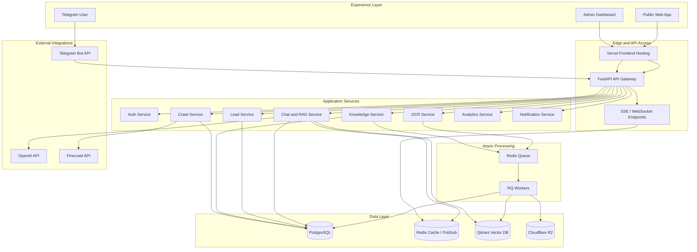

## 2) Sơ đồ luồng Chat RAG
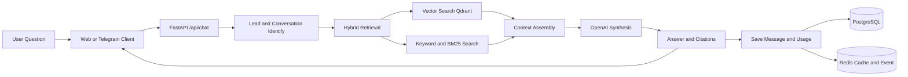

## 3) Sơ đồ luồng OCR/Crawl ingest tri thức
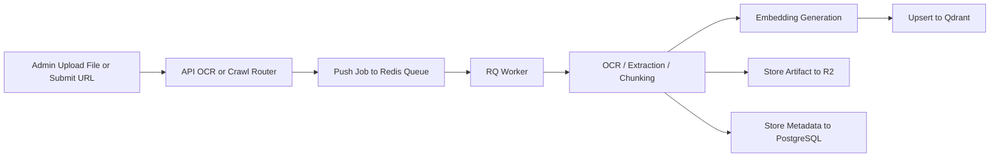

## 4) Sơ đồ triển khai (Deployment)
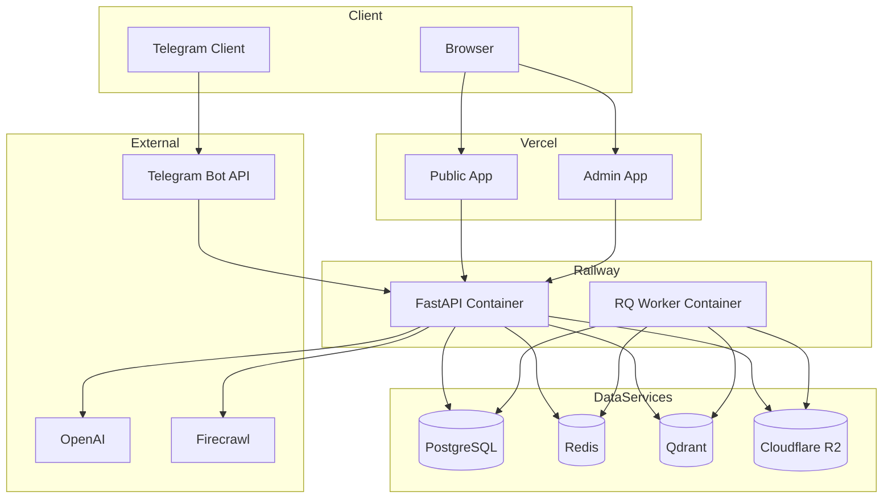

## 5) Sequence realtime (SSE)
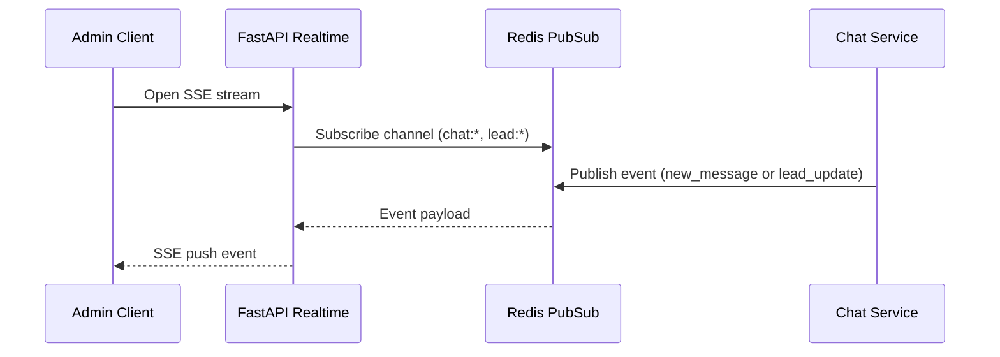

## 6) ERD cốt lõi
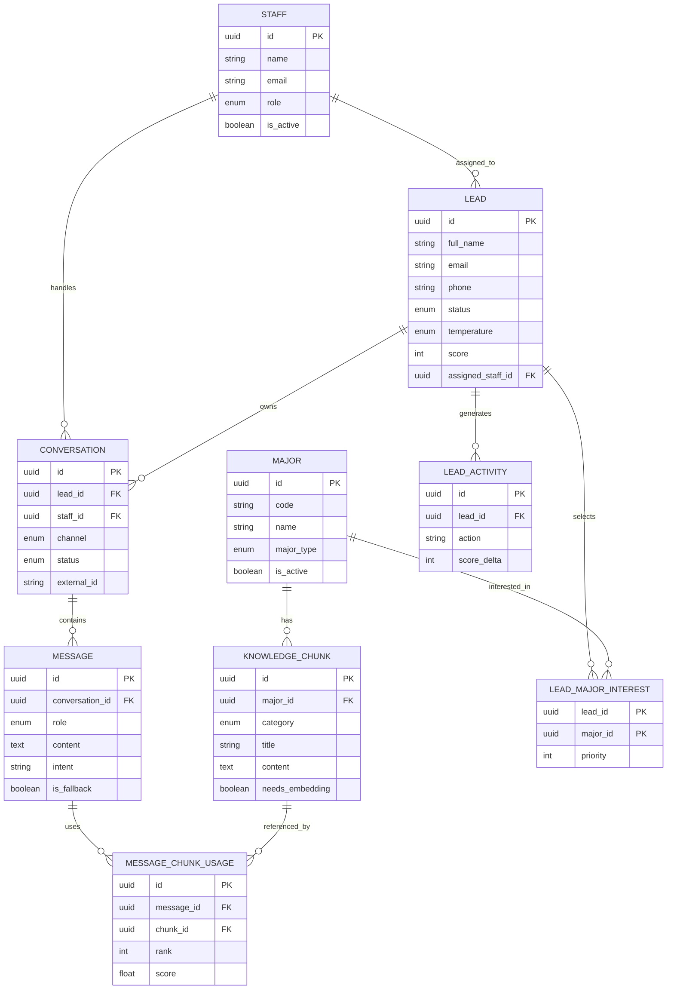

## 7) Use Case Diagram
Lưu ý: Mermaid chưa có UML use case gốc, nên sơ đồ dưới đây dùng `flowchart` để biểu diễn cùng ý nghĩa.

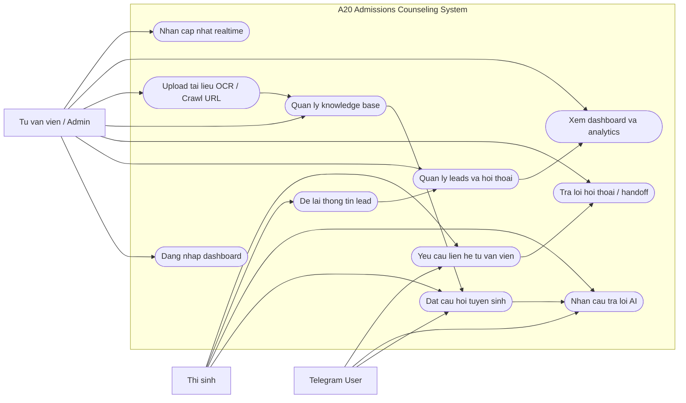

## 8) Database ERD mở rộng
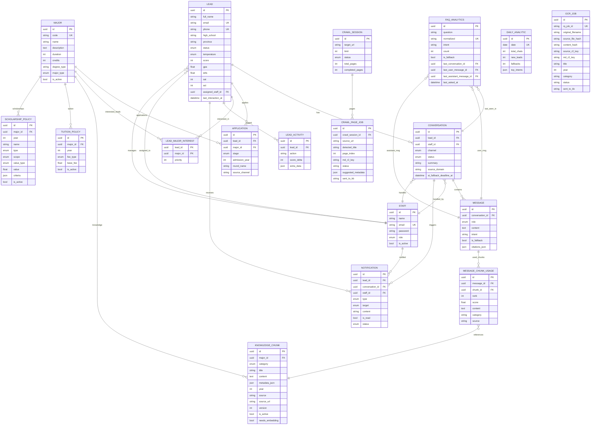

## 9) Auth Flow - JWT Cookie-based Sequence
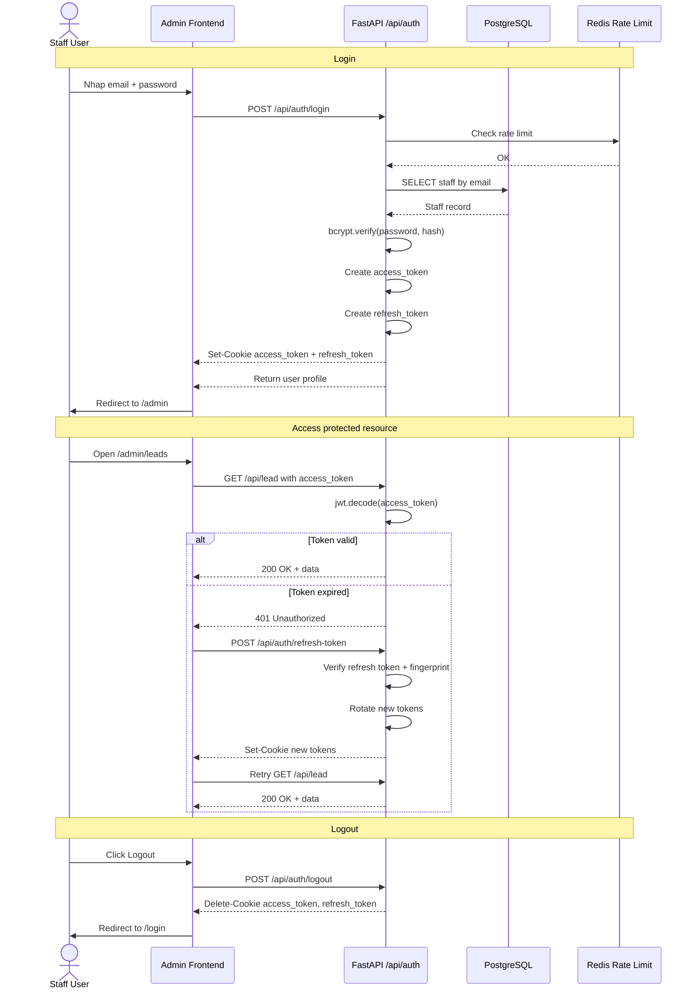

## 10) Lead State Machine
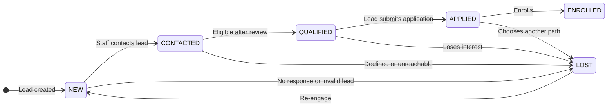

### Application Stage
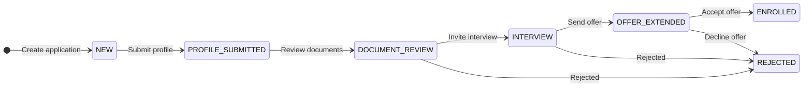

### Conversation Status
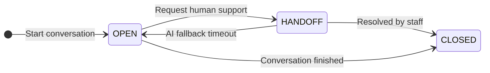

## 11) Human Handoff Flow - Sequence Diagram
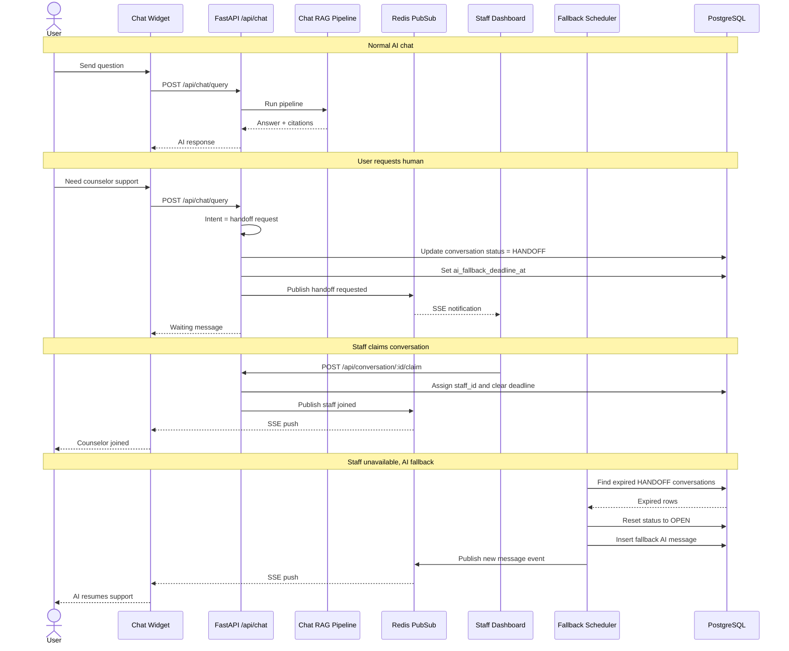

## 12) C4 Model - Context and Container
### C4 Level 1 - System Context
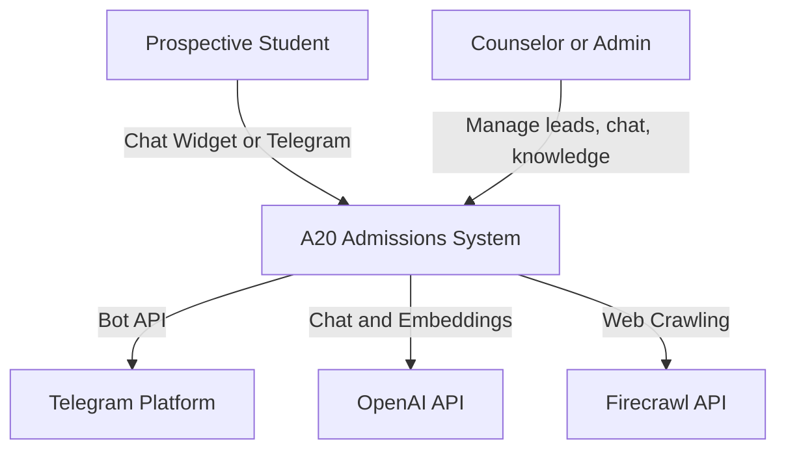

### C4 Level 2 - Container Diagram
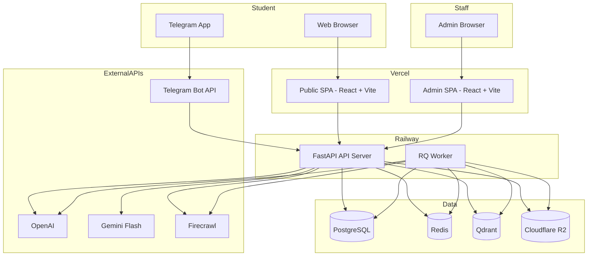

---

## 13) Gợi ý sử dụng khi thuyết trình
- Slide 1: Sơ đồ tổng quát theo lớp.
- Slide 2: Luồng Chat RAG.
- Slide 3: Luồng OCR/Crawl.
- Slide 4: Deployment + Realtime.
- Slide 5: ERD cốt lõi.
- Slide 6: Use Case Diagram.
- Slide 7: Auth Flow.
- Slide 8: Lead State Machine.
- Slide 9: Human Handoff Flow.
- Slide 10: C4 Context + Container.
- Phụ lục kỹ thuật: Database ERD mở rộng.
