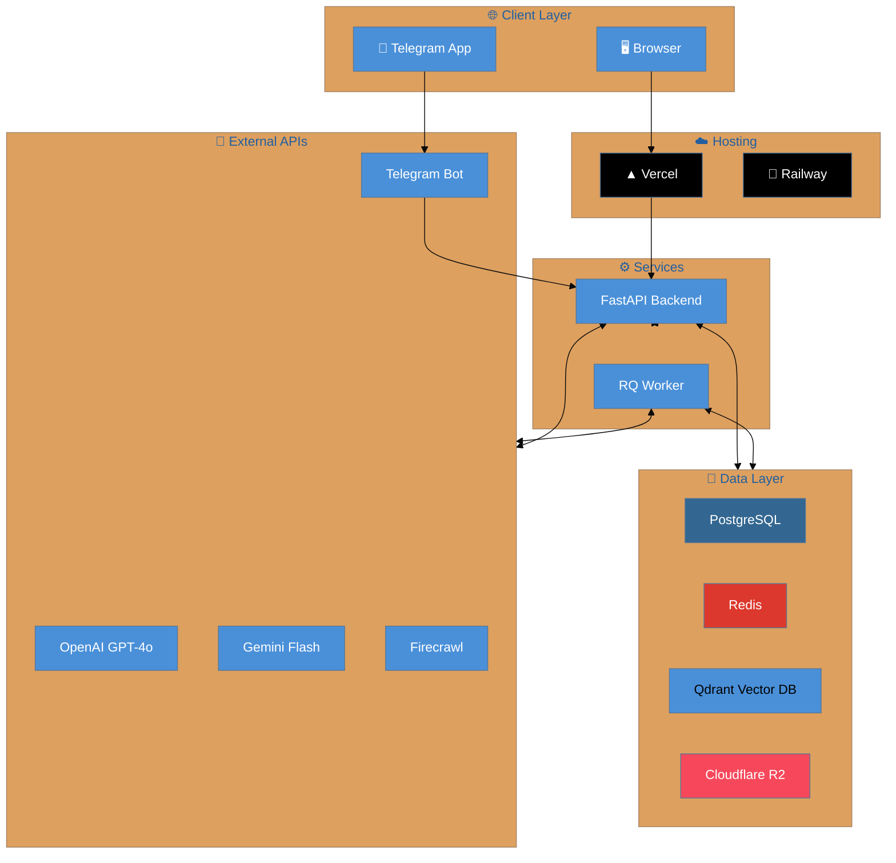
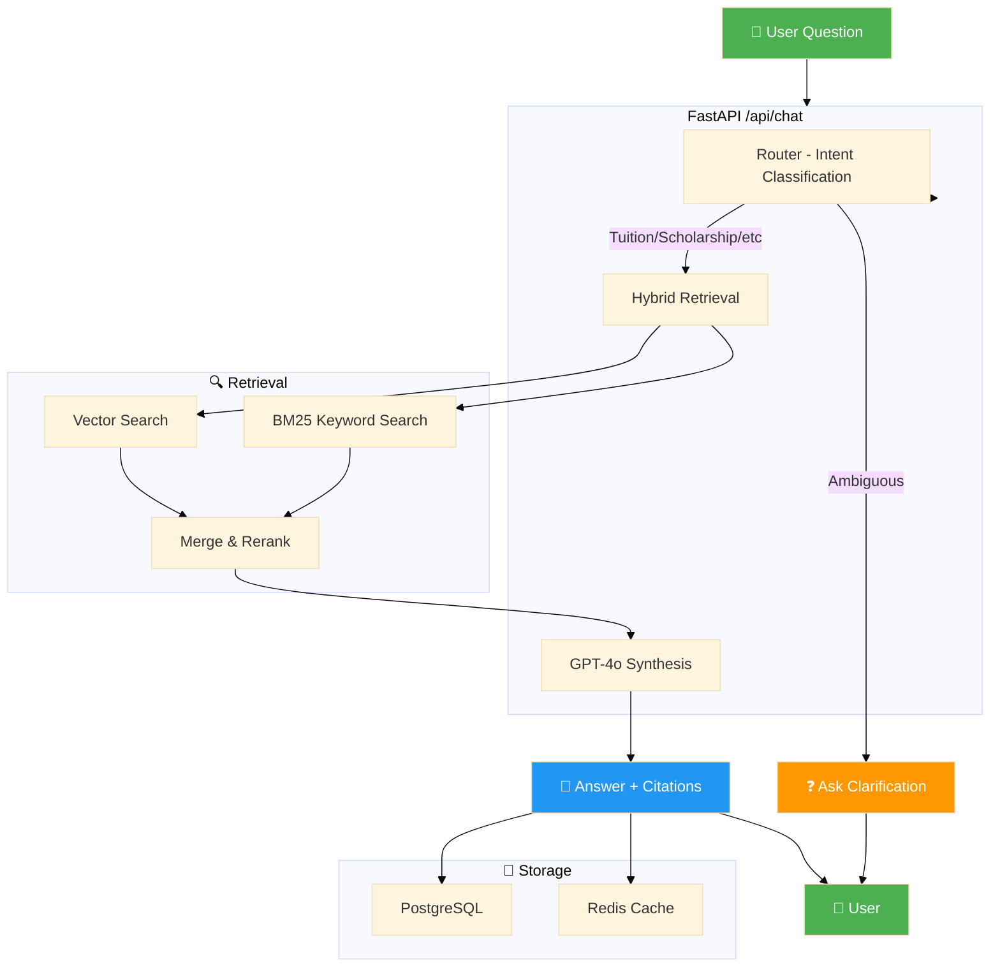
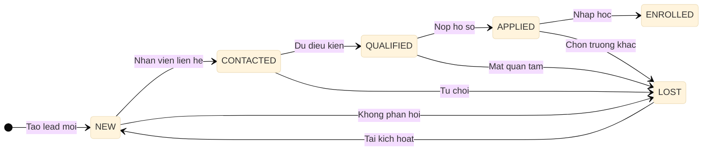
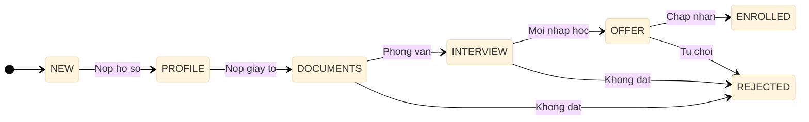
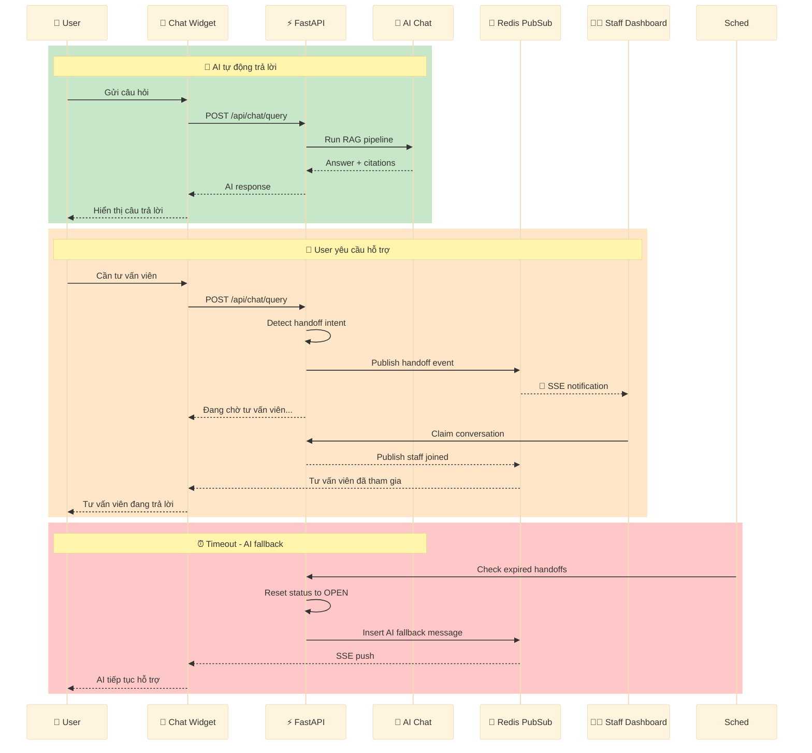
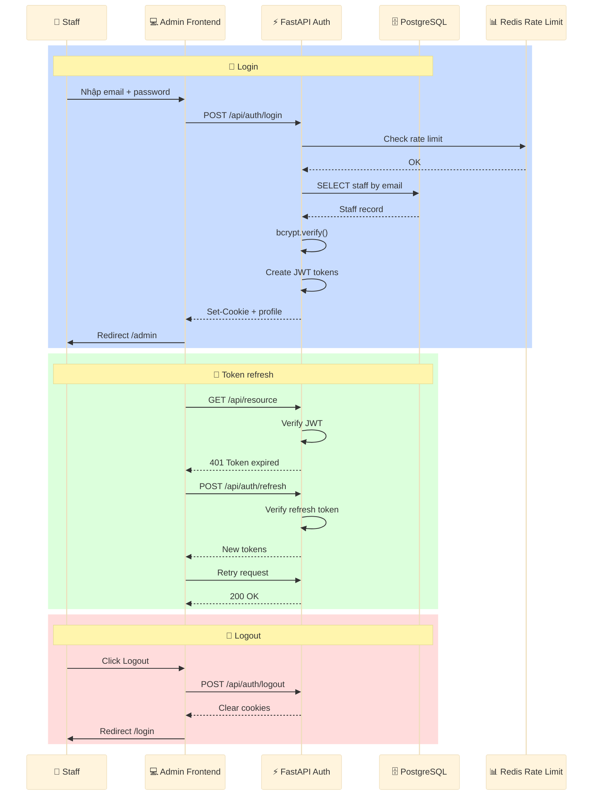
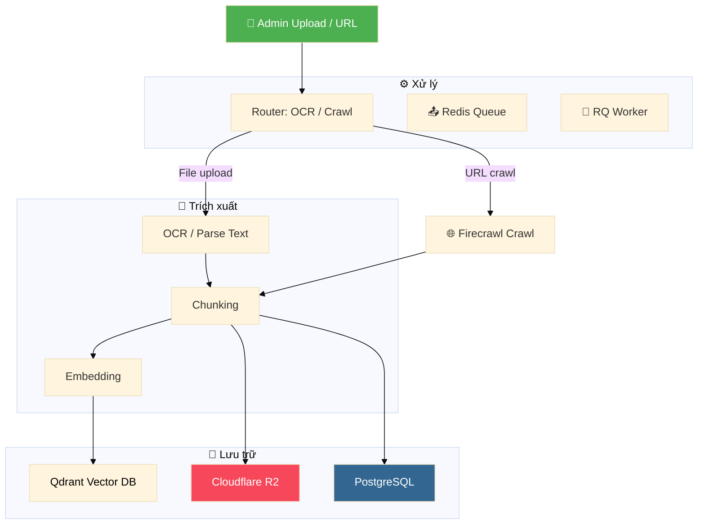
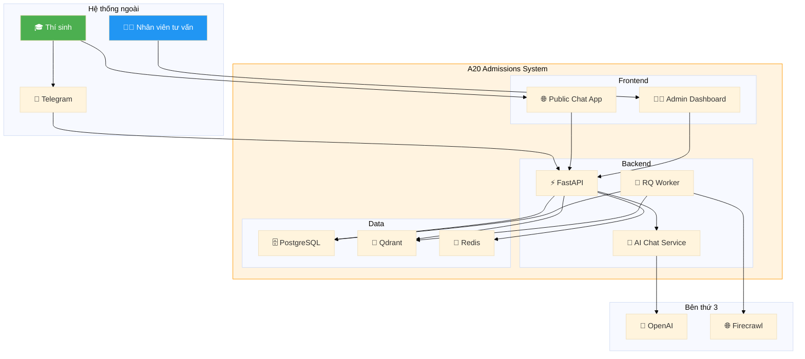

# Sơ đồ Kiến trúc - Clean Versions

Phiên bản clean của các sơ đồ Mermaid, giữ nguyên nội dung nhưng tổ chức lại cho dễ đọc và trình bày.

---

## 1. Sơ đồ Deployment (Triển khai)

**Render:** [Mermaid Live Editor](https://mermaid.live/edit#pako:eNo9zz1OwzAQhV_l5FgqLlKhVCp1CCGKFBcGN2BmwsLkNOkGpuYIwdAPEU_c-PVJlqT-e_ze2I6lZEvyR6Kf7X3bdnY_8p1t3WFP6N0K7X2n2s6P7i5O2K8qJ-vqR9H4KzK9pXU3mV7T9Kf6o9dHdl0q3T7V1K9Jf8bJ9t7q3tK4r0y2l3i2hXUrqRyV2Z2V3Z3Z3Z3Z3Z3Z3Z)

---

## 2. Sơ đồ Chat RAG Flow

---

## 3. Lead State Machine

---

## 4. Application Stage Flow

---

## 5. Human Handoff Flow

---

## 6. Auth Flow (JWT)

---

## 7. Knowledge Ingestion Flow

---

## 8. C4 Context Diagram

---

## Cách render sơ đồ ra ảnh

### Cách 1: Mermaid Live Editor
1. Copy code Mermaid vào https://mermaid.live
2. Click "Actions" → "Export PNG/SVG"

### Cách 2: Dùng AI vẽ lại
1. Copy nội dung text mô tả
2. Paste vào AI image generator (Claude, GPT-4o, etc.)
3. Yêu cầu vẽ theo style clean, professional

### Cách 3: VS Code Extension
1. Cài extension "Mermaid Markdown Syntax Highlighting"
2. Preview trực tiếp trong VS Code

---

## So sánh với bản gốc

| Sơ đồ | Cải tiến |
|-------|----------|
| Deployment | Thêm màu sắc, biểu tượng, group rõ ràng |
| Chat RAG | Tách retrieval thành sub-graph riêng |
| Lead State | Giữ nguyên logic, thêm note mô tả |
| Application Flow | Đơn giản hóa, màu sắc phân biệt |
| Human Handoff | Dùng rect để phân biệt 3 giai đoạn |
| Auth Flow | Tách 3 flows riêng biệt |
| Knowledge Ingestion | Thêm icons, màu sắc |
| C4 Context | Rõ ràng hơn với border và fill |
