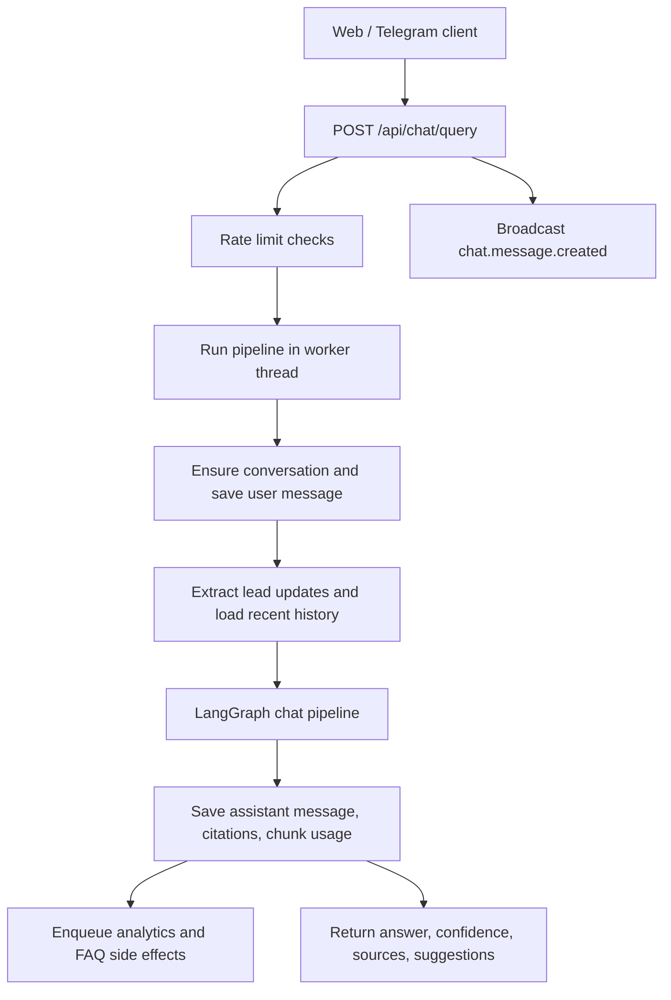
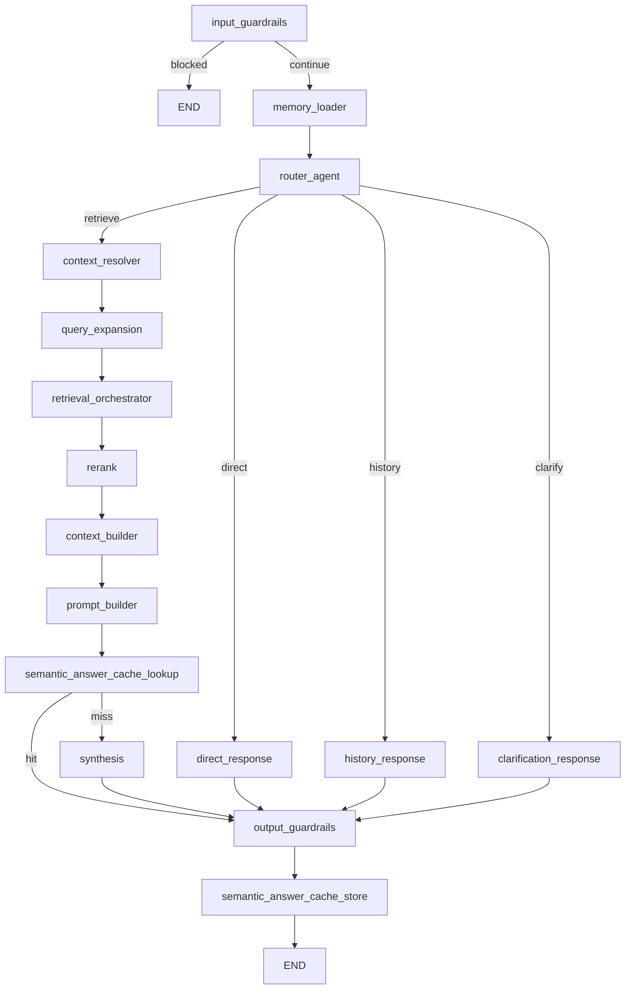
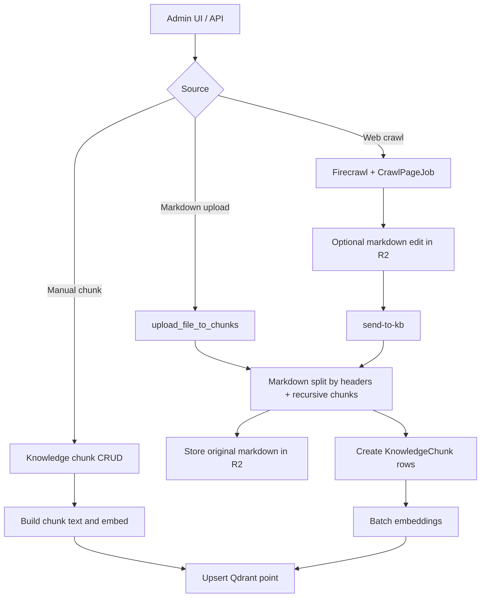

# RAG Pipeline Architecture

Tài liệu này mô tả kiến trúc RAG pipeline hiện tại của A20 App dựa trên source code. Các tài liệu đang có như `README.md`, `docs/SYSTEM_DESIGN_BACKEND.md`, `docs/ARCHITECTURE_DIAGRAMS*.md`, `docs/ARCHITECTURE_DECISIONS.md` và `docs/ragas_evaluation_report.md` đã nhắc đến RAG, nhưng chủ yếu ở mức overview, ADR, sơ đồ hoặc đánh giá. Tài liệu này là bản chuyên biệt cho kiến trúc pipeline.

## 1. Phạm vi

RAG pipeline gồm hai phần liên kết chặt chẽ:

- Knowledge ingestion: đưa tài liệu tuyển sinh vào PostgreSQL, R2 và Qdrant.
- Chat-time RAG: nhận câu hỏi, định tuyến, truy hồi, rerank, tổng hợp câu trả lời, lưu citation và usage.

Các entry point chính:

- Chat API: `src/api/routers/chat.py`, endpoint `POST /api/chat/query`.
- Pipeline runner: `src/services/chat_pipeline/pipeline.py`.
- LangGraph workflow: `src/services/chat_pipeline/graph.py`.
- Knowledge API: `src/api/routers/knowledge_chunk.py`.
- Crawl-to-KB API: `src/api/routers/crawl.py`.

## 2. Tổng quan luồng chat

`run_chat_pipeline()` tạo `PipelineState`, bảo đảm conversation tồn tại, lưu user message trước khi chạy graph, sau đó lưu assistant message và `message_chunk_usage` dựa trên các chunk đã rerank. Nếu conversation đang ở trạng thái `HANDOFF`, pipeline không sinh câu trả lời AI mà chỉ ghi nhận user message và trả `retrieval_mode=handoff`.

## 3. LangGraph pipeline

Workflow được build trong `build_chat_graph(db)`:

Pipeline nodes:

| Node | File | Vai trò |
|---|---|---|
| `input_guardrails` | `guardrails.py` | Chặn query quá ngắn hoặc chứa pattern nguy hiểm. |
| `memory_loader` | `memory.py` | Nạp lead profile, interests, conversation summary và recent lead activities. |
| `router_agent` | `router_agent.py` | Phân loại intent, answer mode, rewrite query bằng Gemini router nếu có, fallback sang OpenAI hoặc deterministic route. |
| `direct_response` | `direct_response.py` | Trả lời greeting, thanks, acknowledgement hoặc profile update, không truy hồi. |
| `history_response` | `history_response.py` | Trả lời câu hỏi về lịch sử chat hoặc thông tin lead đã lưu. |
| `clarification_response` | `direct_response.py` | Hỏi thêm ngành, bậc học, năm tuyển sinh khi query thiếu ngữ cảnh. |
| `context_resolver` | `query_context_resolver.py` | Sửa lỗi gõ phổ biến, nhận diện major/topic/level/scope, dùng context lịch sử khi phù hợp. |
| `query_expansion` | `query_expansion.py` | Mở rộng query bằng nhóm synonym Việt/Anh cho học phí, học bổng, ngành, tuyển sinh, deadline. |
| `retrieval_orchestrator` | `retrieval_orchestrator.py` | Chọn và chạy tool truy hồi deterministic theo intent. |
| `rerank` | `rerank.py` | Re-score candidate theo score gốc, overlap với query và tín hiệu nguồn. |
| `context_builder` | `context_builder.py` | Gom evidence theo nhóm major, tuition và supporting evidence. |
| `prompt_builder` | `prompt_builder.py` | Tạo grounded prompt, thêm history, memory và rule ưu tiên dữ liệu DB. |
| `semantic_answer_cache_lookup` | `semantic_answer_cache.py` | Tìm câu trả lời tương tự dựa trên fingerprint query/evidence trước khi gọi LLM. |
| `synthesis` | `synthesis.py` | Gọi OpenAI chat model để sinh JSON answer và follow-up suggestions. |
| `output_guardrails` | `guardrails.py` | Chặn answer rỗng và hạ confidence khi không có evidence. |
| `semantic_answer_cache_store` | `semantic_answer_cache.py` | Lưu answer đủ tin cậy vào Redis + Qdrant semantic cache. |

`PipelineState` trong `types.py` là state contract giữa các node. Các field quan trọng gồm `query`, `resolved_query`, `search_query`, `intent`, `answer_mode`, `selected_tools`, `candidates`, `reranked`, `context_block`, `grounded_prompt`, `answer`, `confidence`, `follow_up_suggestions` và `node_timings_ms`.

## 4. Retrieval architecture

### 4.1 Router và context resolution

Router hỗ trợ các intent:

- `tuition_lookup`
- `scholarship_lookup`
- `timeline_process`
- `admission_requirement`
- `program_info`
- `school_info`
- `general_question`

Answer mode hợp lệ là `direct`, `retrieve`, `clarify` và `history`. Với mode `retrieve`, `context_resolver` tìm major hiện tại, major trong lịch sử, topic như `tuition`, `scholarship`, `requirement`, `deadline`, `curriculum`, `course_credits`, và level như `cu nhan`, `thac si`, `tien si`. Kết quả được ghi vào `resolved_context` và có thể tạo `resolved_query` để truy hồi chính xác hơn.

### 4.2 Tool orchestration

`retrieval_orchestrator` chọn tối đa 3 tool sau:

- `get_all_majors`: đọc danh sách major active từ bảng `major`, có cache.
- `get_major_info`: tìm major theo text/code và đọc chi tiết từ DB, có cache.
- `get_tuition_by_major`: đọc học phí từ bảng tuition policy, có cache.
- `search_db`: sparse retrieval trên `knowledge_chunk`.
- `search_vector`: dense retrieval trên Qdrant.
- `search_hybrid`: dense + sparse fusion.

Routing deterministic hiện tại:

- Câu hỏi danh sách chương trình: `get_all_majors` + `search_vector`.
- Học phí: `get_tuition_by_major` + `search_vector`.
- Học bổng, yêu cầu tuyển sinh, timeline: `search_hybrid`.
- Thông tin chương trình: `get_major_info`, `get_tuition_by_major`, `search_vector`; riêng curriculum/course credits ưu tiên thêm `search_hybrid`.
- Fallback chung: `search_hybrid`.

Tool-backed candidates từ DB có `path` dạng `tool:*` và được bảo vệ khi chọn top candidates để tránh bị loại bởi search evidence.

### 4.3 Dense retrieval

Dense retrieval dùng:

- Embedding client: `langchain_openai.OpenAIEmbeddings`.
- Model mặc định: `EMBEDDING_MODEL`, trong config là `text-embedding-3-small`.
- Vector dimension: `EMBEDDING_DIMENSION`, mặc định `1536`.
- Vector store: Qdrant collection `QDRANT_KNOWLEDGE_COLLECTION`, mặc định `knowledge_chunks`.
- Distance: cosine.

Mỗi Qdrant point có id bằng `KnowledgeChunk.id` và payload:

- `chunk_id`
- `major_id`
- `category`
- `title`
- `content`
- `year`
- `source`
- `source_url`
- `version`
- `is_active`
- `metadata_json`

### 4.4 Sparse retrieval

Sparse retrieval ưu tiên BM25:

- Package: `rank_bm25`.
- Corpus: tối đa 10.000 active `KnowledgeChunk`, sắp theo `updated_at desc`.
- Text index: `category`, `title`, `content`, `source`, `year`.
- Tokenization: dùng `underthesea.word_tokenize` nếu có, fallback regex Unicode.
- Cache: in-memory cache key `bm25_active_chunks`, TTL 7200 giây.

Nếu BM25 lỗi hoặc package không có, fallback là SQL `ILIKE` trên `title`, `content`, `source` với tối đa 8 từ trong query.

### 4.5 Hybrid fusion và rerank

`hybrid_retrieval()` chạy dense retrieval song song với sparse retrieval, sau đó merge theo chunk id. Fusion dùng Reciprocal Rank Fusion:

- RRF constant: `25`.
- Raw score tie-break weight: `0.05`.
- Feature gồm `rrf_score`, `raw_score_tie_break`, `match_count`.

`run_rerank()` tiếp tục cộng thêm:

- lexical coverage giữa query và candidate text,
- source bonus cho `tool:*`, `sparse+dense`, `sparse`, `dense`,
- penalty nhỏ cho content quá ngắn.

Default `top_k` từ request là 10, clamp 1-50 trong orchestrator. `rerank_keep` mặc định là 5.

## 5. Knowledge ingestion architecture

Manual CRUD:

- `create_knowledge_chunk()` và `update_knowledge_chunk()` ghi DB rồi tạo embedding ngay.
- Nếu embedding/upsert lỗi, `needs_embedding=True` để admin chạy rebuild.
- `rebuild_missing_embeddings()` xử lý active chunks có `needs_embedding=True`, limit 1-500.

Markdown upload:

- `extract_text()` hiện chỉ hỗ trợ file `.md`.
- `chunk_text()` dùng `MarkdownHeaderTextSplitter` cho heading `#` đến `####`, sau đó `RecursiveCharacterTextSplitter`.
- Upload API mặc định `chunk_size=1200`, `chunk_overlap=100`.
- File gốc được lưu R2, chunks được lưu vào PostgreSQL và batch-upsert vào Qdrant.

Crawl:

- `/api/crawl/sessions/` enqueue `run_crawl_background()` qua Redis/RQ.
- Firecrawl trả markdown từng page, lưu artifact vào R2 và record `CrawlPageJob`.
- Admin có thể sửa markdown trước khi `send-to-kb`.
- `send_crawl_page_job_to_knowledge_base()` gọi `upload_file_to_chunks()` với `source=page_job.source_url` và metadata crawl.

## 6. Prompting, synthesis và cache

`context_builder` format mỗi source thành `[EVIDENCE n]` và chia thành:

- `Major Information`
- `Tuition Information`
- `Supporting Evidence`

`prompt_builder` tạo grounded prompt gồm user question, context, recent conversation, lead memory và task notes. Nếu có nguồn DB authoritative như `major_table` hoặc `tuition_policy_table`, prompt yêu cầu ưu tiên dữ liệu DB hơn supporting evidence. Với danh sách major, prompt yêu cầu trả đủ toàn bộ program từ DB context.

`synthesis`:

- Gọi `OPENAI_CHAT_MODEL`, mặc định trong config là `gpt-4o-mini`.
- Temperature `0.2`.
- Max tokens `1200`.
- Response format JSON object.
- Dùng Redis semaphore `llm_concurrency:counter`, tối đa 10 LLM calls đồng thời, timeout acquire 8 giây.
- Nếu không có context, trả insufficient-context answer với confidence thấp.
- Có deterministic fallback riêng cho global scholarship overview.

Semantic answer cache:

- Lookup sau khi build prompt, trước synthesis.
- Chỉ dùng cho `answer_mode=retrieve`, có context và có `reranked`.
- Fingerprint gồm intent, answer mode, resolved query, topic, scope, major, level, selected tools và evidence signature.
- Vector cache nằm trong Qdrant collection `QDRANT_SEMANTIC_ANSWER_CACHE_COLLECTION`, mặc định `semantic_answer_cache`.
- Payload answer nằm trong Redis key prefix `semantic_answer_cache:payload:`.
- Store khi confidence >= 0.55, không blocked, không cache hit, có evidence, answer không thuộc nhóm fallback.

## 7. Persistence, citation và response contract

Sau graph:

- Assistant message được lưu vào bảng `message`.
- `citations_json` lưu tối đa 3 URL.
- `message_chunk_usage` lưu chunk id, rank, score, content, category, source cho các candidate có `chunk_id`.
- Lead activity và lead score được cập nhật.
- Side effects được enqueue qua `enqueue_chat_turn_side_effects()`.

Response `ChatQueryResponse` trả:

- `answer`
- `confidence`
- `blocked`
- `retrieval_mode`
- `selected_tools`
- `citations`
- `sources`
- `follow_up_suggestions`
- conversation và lead status fields

Lưu ý citation hiện tại: `build_message_citations_from_chunks()` chỉ tạo citation nếu field `source` là URL HTTP/HTTPS. Field `source_url` trong candidate không được dùng để tạo citation ở hàm này.

## 8. Error handling và fallback

- Conversation `CLOSED`: trả HTTP 409.
- Conversation `HANDOFF`: không chạy RAG, trả answer rỗng và `retrieval_mode=handoff`.
- Input guardrails blocked: lưu assistant message với intent `blocked`, confidence `0.0`.
- Pipeline exception: rollback, tạo assistant fallback message, tăng fallback metric và ghi lead activity `PIPELINE_ERROR`.
- Output guardrails: nếu retrieval mode nhưng không có `reranked`, trả thông báo chưa tìm thấy dữ liệu phù hợp và confidence tối đa `0.35`.

## 9. Observability và evaluation

Observability trong pipeline:

- Mỗi LangGraph node ghi timing vào `node_timings_ms`.
- `pipeline.py` log timing summary sau khi graph hoàn tất.
- `retrieval_orchestrator.py` log timing từng tool và summary số candidate.
- `synthesis.py` log prompt size, context size và evidence count.
- `semantic_answer_cache.py` log hit, miss, store và error.

Evaluation/test assets liên quan:

- `tests/test_chat_pipeline.py`
- `test_chat_pipeline_scholarship.py`
- `src/evaluation/rag_evaluator.py`
- `src/evaluation/deepeval_runner.py`
- `scripts/generate_rag_dataset.py`
- `docs/ragas_evaluation_report.md`
- `docs/RETRIEVAL_OPTIMIZATION_LOG.md`

## 10. Config liên quan

| Setting | Mặc định trong code/env | Vai trò |
|---|---:|---|
| `OPENAI_CHAT_MODEL` | `gpt-4o-mini` trong code, `.env.example` đang ghi `gpt-4o` | Model synthesis và fallback router khi không có Gemini. |
| `GEMINI_ROUTER_MODEL` | `gemini-3-flash-preview` trong `.env.example` | Model router nếu Gemini client khả dụng. |
| `EMBEDDING_MODEL` | `text-embedding-3-small` | Model embedding cho chunks và semantic answer cache. |
| `EMBEDDING_DIMENSION` | `1536` | Dimension Qdrant vector. |
| `QDRANT_KNOWLEDGE_COLLECTION` | `knowledge_chunks` | Collection knowledge chunks. |
| `QDRANT_FAQ_COLLECTION` | `faq_analytics` | Collection FAQ analytics. |
| `QDRANT_SEMANTIC_ANSWER_CACHE_COLLECTION` | `semantic_answer_cache` | Collection cache vector câu trả lời. |
| `SEMANTIC_ANSWER_CACHE_ENABLED` | `true` | Bật/tắt answer cache. |
| `SEMANTIC_ANSWER_CACHE_TTL_SECONDS` | `43200` | TTL payload cache trong Redis. |
| `SEMANTIC_ANSWER_CACHE_SCORE_THRESHOLD` | `0.92` | Ngưỡng semantic cache hit. |
| `CHAT_QUERY_RATE_LIMIT_PER_MINUTE` | `12` | Rate limit theo lead/phút. |
| `CHAT_QUERY_RATE_LIMIT_PER_HOUR` | `120` | Rate limit theo lead/giờ. |
| `CHAT_QUERY_IP_RATE_LIMIT_PER_MINUTE` | `30` | Rate limit theo IP/phút. |

## 11. Current behavior / known gaps

- `update_knowledge_chunk_status()` khi deactive chunk chỉ set `is_active=False` trong PostgreSQL, không xóa hoặc cập nhật Qdrant point. Dense retrieval chỉ bỏ qua Qdrant point nếu payload `is_active` đã là `false`, nên cần cẩn trọng khi deactive thủ công. Delete chunk và delete uploaded file có gọi xóa vector.
- BM25 index cache có TTL 7200 giây và hiện chưa thấy hook gọi `invalidate_sparse_cache()` khi knowledge chunk thay đổi.
- Citation URL chỉ lấy từ `source` nếu `source` là HTTP/HTTPS URL; `source_url` không được dùng trong citation builder hiện tại.
- Sparse fallback `ILIKE` không rank sâu theo relevance, chỉ dùng như đường dự phòng khi BM25 không chạy được.
