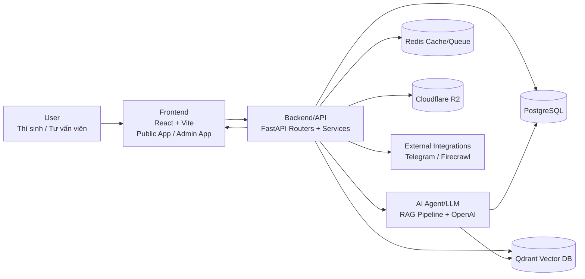

# A20 App - System Design Document

> Admissions Counseling AI System

## 1. Overview

A20 is a full-stack web application providing AI-powered admissions counseling for VinUniversity students. The system manages student leads, conversations, knowledge bases, and integrates multiple channels (web chat, Telegram) with a RAG-based AI assistant.

**Tech Stack:**
- **Frontend:** React 19 + TypeScript + Vite + Tailwind CSS v4 + shadcn/ui
- **Backend:** FastAPI + SQLAlchemy + Alembic
- **Database:** PostgreSQL
- **Cache/Queue:** Redis + RQ
- **Vector Store:** Qdrant
- **Object Storage:** Cloudflare R2
- **AI:** OpenAI GPT-4o-mini + Embeddings
- **Crawling:** Firecrawl

---

## 2. Architecture

```
┌─────────────────────────────────────────────────────────────┐
│                        Frontend                              │
│   React 19 + TypeScript + Vite + Tailwind + shadcn/ui       │
│   TanStack Query + Zustand + React Router v7                │
└─────────────────────┬───────────────────────────────────────┘
                      │ HTTP/SSE
┌─────────────────────▼───────────────────────────────────────┐
│                     Backend (FastAPI)                        │
│  ┌──────────┐  ┌──────────┐  ┌──────────┐  ┌─────────────┐ │
│  │   Auth   │  │   Chat   │  │   Lead   │  │ Knowledge   │ │
│  │  Router  │  │  Router  │  │  Router  │  │   Router    │ │
│  └──────────┘  └──────────┘  └──────────┘  └─────────────┘ │
│  ┌──────────┐  ┌──────────┐  ┌──────────┐  ┌─────────────┐ │
│  │   OCR    │  │  Crawl   │  │ Telegram │  │  Analytics  │ │
│  │  Router  │  │  Router  │  │  Router  │  │   Router    │ │
│  └──────────┘  └──────────┘  └──────────┘  └─────────────┘ │
└────────┬───────────────┬───────────────┬───────────────────┘
         │               │               │
    ┌────▼────┐    ┌─────▼─────┐  ┌─────▼─────┐
    │PostgreSQL│    │   Redis   │  │  Qdrant   │
    │  (Main  │    │(Cache/RQ) │  │ (Vectors) │
    │   DB)   │    └───────────┘  └───────────┘
    └─────────┘
         │
    ┌─────▼─────┐
    │  Cloudflare│
    │    R2     │
    │ (Files)   │
    └───────────┘
```

---

## 3. ARCHITECTURE

Sơ đồ User, Frontend, Backend/API, Database, AI Agent/LLM và luồng dữ liệu chính.



Luồng dữ liệu chính:
1. User gửi câu hỏi từ Web/Telegram qua Frontend.
2. Frontend gọi Backend API để xử lý nghiệp vụ.
3. Backend chạy RAG (truy xuất Qdrant + dữ liệu nghiệp vụ) và gọi LLM.
4. Kết quả được lưu PostgreSQL/Redis và trả phản hồi về Frontend theo thời gian thực.
