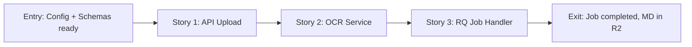

# Phase Contract: Phase 1 - Backend OCR Pipeline

**Date**: 2026-04-27
**Feature**: ocr-quick-processing
**Phase Plan Reference**: `history/ocr-quick-processing/phase-plan.md`
**Based on**:
- `history/ocr-quick-processing/CONTEXT.md`
- `history/ocr-quick-processing/discovery.md`
- `history/ocr-quick-processing/approach.md`

---

## 1. What This Phase Changes

Backend có API endpoint `/api/ocr-quick/jobs` nhận file upload (PDF, PNG, JPG, WEBP, TIFF), trả về job ID ngay lập tức. OCR chạy background qua Redis Queue. Khi job complete, MD file lưu ở R2 và suggested category được trả về kèm status.

Phase 1 hoàn thành khi: Upload 1 file PDF → nhận job_id + suggested_category → poll status → completed → get MD URL.

---

## 2. Why This Phase Exists Now

Backend phải có trước vì API là contract cho frontend. Frontend (Phase 2) không thể bắt đầu nếu không có API để gọi. Backend có thể test độc lập qua curl/Postman mà không cần UI.

---

## 3. Entry State

- `GEMINI_API_KEY` đã được thêm vào `.env` và `src/core/config.py`
- `google-genai` và `pymupdf` đã được add vào `requirements.txt`
- `src/schemas/ocr.py` đã define request/response models
- Database không có thay đổi — reuse `KnowledgeChunk` model cho Phase 3

---

## 4. Exit State

- [ ] `POST /api/ocr-quick/jobs` — upload file, nhận job_id + suggested_category (ngay cả khi `queued`)
- [ ] `GET /api/ocr-quick/jobs/{job_id}` — check status, always returns `suggested_category` object
- [ ] `GET /api/ocr-quick/jobs/{job_id}/download` — get MD file URL từ R2
- [ ] RQ worker xử lý OCR job: PDF→images → Gemini Vision → MD → R2
- [ ] AI category detection: analyze MD content → return `category_id`, `confidence`, `reason`, `needs_review`
- [ ] Idempotency: `X-Idempotency-Key` header supported
- [ ] Error handling: `failed` status với `error_message` cho invalid files, timeouts, empty results

---

## 5. Demo Walkthrough

**Test với curl:**
```bash
# 1. Upload file
curl -X POST http://localhost:8000/api/ocr-quick/jobs \
  -F "file=@test.pdf" \
  -F "category_mode=auto_detect" \
  -H "Authorization: Bearer $TOKEN"

# Response: {"job_id": "abc123", "status": "queued", "suggested_category": null}

# 2. Poll status
curl http://localhost:8000/api/ocr-quick/jobs/abc123 \
  -H "Authorization: Bearer $TOKEN"

# Response: {"job_id": "abc123", "status": "completed", "suggested_category": {"category_id": "admissions", "confidence": 0.87, ...}, "md_r2_key": "ocr-output/xyz.md"}

# 3. Download MD
curl http://localhost:8000/api/ocr-quick/jobs/abc123/download
# Response: {"url": "https://pub-xxx.r2.dev/ocr-output/xyz.md"}
```

### Demo Checklist

- [ ] Upload PDF → job_id returned immediately
- [ ] Status shows `queued` → `processing` → `completed`
- [ ] `suggested_category` present in status response (immutable per job)
- [ ] Download endpoint returns R2 URL
- [ ] Invalid file → `failed` status with error_message
- [ ] Retry with same idempotency key → same job

---

## 6. Story Sequence At A Glance

| Story | What Happens | Why Now | Unlocks Next | Done Looks Like |
|-------|--------------|---------|--------------|-----------------|
| Story 1: API upload endpoint | POST /jobs nhận file, validate, upload source to R2, enqueue RQ job, return job_id | Contract giữa FE và BE — phải có đầu tiên | Story 2 + 3 có job_id để track | Job created in DB, job_id returned |
| Story 2: OCR service | Gemini Vision → markdown + category detection | Core OCR logic — cần work trước Story 3 | Story 3 có OCR logic để call | MD text + suggested_category returned |
| Story 3: RQ job handler | Worker picks job → calls OCR service → stores MD to R2 → updates job status | Enables D1 batch queuing + background processing | Phase 1 exit state met | Job completed, MD in R2, status updated |

---

## 7. Phase Diagram



---

## 8. Out Of Scope

- Frontend UI (Phase 2)
- Auto-embedding pipeline call (Phase 3)
- Job retry endpoint
- Batch job listing endpoint
- MD preview/edit (Phase 2)

---

## 9. Success Signals

- API responds < 500ms cho upload endpoint (job enqueued, không blocking)
- OCR job completes trong < 60s cho 10-page PDF
- `suggested_category` luôn present trong status response
- Invalid file upload → proper error response, không crash

---

## 10. Failure / Pivot Signals

- Gemini API returns error → job marked `failed` with `error_message`
- PDF conversion fails → `failed` with "Cannot process PDF"
- RQ worker crashes → job stays `processing` forever (monitor needed)
- MD output empty → `completed` with warning flag, not `failed`