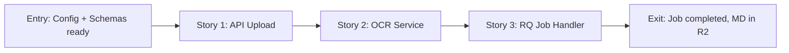

# Story Map: Phase 1 - Backend OCR Pipeline

**Date**: 2026-04-27
**Phase Plan**: `history/ocr-quick-processing/phase-plan.md`
**Phase Contract**: `history/ocr-quick-processing/phase-1-contract.md`
**Approach Reference**: `history/ocr-quick-processing/approach.md`

---

## 1. Story Dependency Diagram



---

## 2. Story Table

| Story | What Happens | Why Now | Contributes To | Creates | Unlocks | Done Looks Like |
|-------|--------------|---------|----------------|---------|---------|-----------------|
| Story 1: API Upload Endpoint | POST /jobs nhận file, validate type/size, upload source to R2, enqueue RQ job, return job_id + suggested_category | Contract giữa FE và BE — phải có đầu tiên | Exit state: POST endpoint works | Job record in DB, source file in R2 | Story 2 + 3 có job_id để track | Upload file → job_id returned immediately (< 500ms) |
| Story 2: OCR Service | Gemini Vision → markdown conversion + AI category detection | Core OCR logic — cần work trước Story 3 | Exit state: OCR produces MD + category | MD text string + CategorySuggestion object | Story 3 có OCR logic để call | Call ocr_service.process_file() → returns {md, category} |
| Story 3: RQ Job Handler | Worker picks job → calls OCR service → stores MD to R2 → updates job status | Enables D1 batch queuing + background processing | Exit state: background processing works | Completed job, MD file in R2, updated job status | Phase 1 exit state met | Job status = completed, md_r2_key populated |

---

## 3. Story Details

### Story 1: API Upload Endpoint

- **What Happens In This Story**: User uploads file via `POST /api/ocr-quick/jobs`. System validates file type (PDF, PNG, JPG, WEBP, TIFF), checks file size (< 50MB), uploads source to R2 with folder `ocr-source/`, creates job record in DB with status `queued`, enqueues RQ job, returns immediately with `{job_id, status: "queued", suggested_category: null}`.
- **Why Now**: API endpoint là contract giữa FE và BE. Không có endpoint thì không thể test backend độc lập.
- **Contributes To**: Exit state - "POST /api/ocr-quick/jobs — upload file, nhận job_id + suggested_category"
- **Creates**:
  - `src/api/routers/ocr_quick.py` — API router với endpoints
  - `src/schemas/ocr.py` — Pydantic models cho request/response
  - Job record in DB (schema: job_id, status, source_r2_key, category_mode, idempotency_key)
  - Source file in R2 bucket under `ocr-source/`
- **Unlocks**: Story 2 và Story 3 có job_id để track và update
- **Done Looks Like**: `curl -X POST /api/ocr-quick/jobs -F "file=@doc.pdf" -H "Authorization: Bearer $TOKEN"` → `{"job_id": "abc123", "status": "queued", "suggested_category": null}`
- **Candidate Bead Themes**:
  - Schema + Router skeleton
  - File validation + R2 upload
  - Job creation + RQ enqueue
  - Idempotency handling

---

### Story 2: OCR Service

- **What Happens In This Story**: `ocr_service.process_file()` nhận file_bytes + file_name. Nếu PDF → convert pages to images bằng PyMuPDF. Gọi Gemini Vision API với prompt yêu cầu markdown output. Gemini trả về markdown text. Sau đó analyze markdown content để detect category: đưa vào prompt cho Gemini kèm list categories, Gemini return category_id + confidence + reason. Trả về `{md_content: str, suggested_category: CategorySuggestion}`.
- **Why Now**: Core OCR logic. Không có OCR thì không có gì để worker xử lý.
- **Contributes To**: Exit state - "OCR job produces markdown + suggested_category"
- **Creates**:
  - `src/services/ocr_service.py` — Gemini Vision OCR logic
  - `src/services/category_detector.py` (hoặc integrate vào ocr_service) — AI category detection
  - Config: GEMINI_API_KEY, GEMINI_MODEL = "gemini-1.5-flash"
- **Unlocks**: Story 3 có `ocr_service.process_file()` để gọi trong worker
- **Done Looks Like**: `ocr_service.process_file(file_bytes, "test.pdf")` → `{"md_content": "# Document Title\n...", "suggested_category": {"category_id": "admissions", "confidence": 0.87, "reason": "...", "needs_review": false}}`
- **Candidate Bead Themes**:
  - OCR service skeleton với Gemini call
  - PDF → image conversion với PyMuPDF
  - Gemini Vision prompt engineering
  - Category detection logic
  - MD content cleanup/post-processing

---

### Story 3: RQ Job Handler

- **What Happens In This Story**: RQ worker picks up job từ queue. Worker đọc job từ DB (job_id), đọc source file từ R2 (source_r2_key), gọi `ocr_service.process_file()` với file_bytes. Khi có MD content + suggested_category, worker upload MD to R2 (folder `ocr-output/`), update job record: status = "completed", md_r2_key = key, suggested_category = object. Nếu error, update status = "failed", error_message = string.
- **Why Now**: Enables D1 (batch queuing) — user có thể upload file, đóng app, quay lại check status. Background processing tránh blocking API.
- **Contributes To**: Exit state - "RQ worker xử lý OCR job, lưu MD output lên R2, update job status"
- **Creates**:
  - `src/services/ocr_job_service.py` — RQ job handler function
  - RQ queue registration (có thể trong `src/services/__init__.py` hoặc separate)
  - `md_r2_key` field update on job record
- **Unlocks**: Phase 1 exit state met — user có thể poll status và download MD
- **Done Looks Like**: Upload file → job queued → worker picks up → processing → completed → poll status → `{"status": "completed", "md_r2_key": "ocr-output/xyz.md", "suggested_category": {...}}`
- **Candidate Bead Themes**:
  - RQ job handler skeleton
  - Job status update logic
  - Error handling + retry logic
  - MD file R2 upload

---

## 4. Story Order Check

- [x] Story 1 is obviously first — API endpoint là contract, không có endpoint thì không test được
- [x] Story 2 must come before Story 3 — Story 3 calls ocr_service, so OCR must exist first
- [x] Story 3 is last because it brings everything together: API → OCR → Worker → R2 storage

---

## 5. Story-To-Bead Mapping

| Story | Beads | Scope | Notes |
|-------|-------|-------|-------|
| Story 1: API Upload Endpoint | A20-App-165-5c5.1.1 (schemas), A20-App-165-5c5.1.2 (router), A20-App-165-5c5.1.3 (config) | S, S, S | Schema and config first, then router |
| Story 2: OCR Service | A20-App-165-5c5.2.1 (Gemini OCR), A20-App-165-5c5.2.2 (category detection) | M, S | OCR service first, then category detection |
| Story 3: RQ Job Handler | A20-App-165-5c5.3.1 (RQ handler) | M | Depends on Story 2 completing |

### Scope Legend
- **S** = Small (~200-400 tokens, 30-60 min): focused, single concern
- **M** = Medium (~400-800 tokens, 60-120 min): moderate complexity, some integration
- **L** = Large (~800-1500 tokens, 2-3 hours): complex, multiple steps

### Dependency Chain
```
A20-App-165-5c5.1.3 (config, S)
    → A20-App-165-5c5.1.1 (schemas, S)
    → A20-App-165-5c5.1.2 (router, S)
    → A20-App-165-5c5.2.1 (OCR service, M)
    → A20-App-165-5c5.3.1 (RQ handler, M)

A20-App-165-5c5.2.1 (OCR service, M)
    → A20-App-165-5c5.2.2 (category detection, S)
```

### Context Budget Assessment
- Total estimated scope: S + S + S + M + S + M = ~1800 tokens equivalent
- Phase fits within single agent context window (estimated 4000-6000 tokens available)
- Sequential dependency ensures no resource contention
- All beads are bounded and focused (no mega-beads)